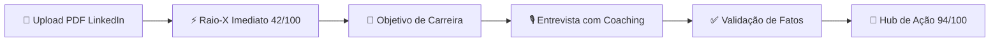

# LinkeGringo 🌎🚀

[](https://opensource.org/licenses/MIT)
[](https://www.typescriptlang.org/)
[](https://react.dev/)
[](https://ai.google.dev/)
[](#privacidade--segurança)

> **Transforme seu perfil do LinkedIn brasileiro em uma máquina de atrair recrutadores internacionais nos EUA.**  
> 100% Client-Side • Bring Your Own Key (BYOK) • Auditoria no DevTools • Gratuito & Open Source.

---

## 💡 O Que é o LinkeGringo?

Muitos engenheiros de software brasileiros altamente qualificados são invisíveis para recrutadores dos Estados Unidos. O motivo não é falta de competência técnica — é o **viés cultural de comunicação**:
- Descrições passivas focadas em tarefas ("Participei do desenvolvimento de...").
- Falta de contexto de impacto, escala e decisões de arquitetura.
- Síndrome do impostor e medo do inglês ("Meu inglês não é perfeito").

O **LinkeGringo** resolve isso através de uma jornada guiada por IA que analisa o seu PDF do LinkedIn, diagnostica gargalos reais, faz uma entrevista adaptativa com dicas de coaching internacional e gera uma versão copy-ready em inglês americano nativo, além de um roteiro prático para as entrevistas.

---

## 🔒 Privacidade em Primeiro Lugar (BYOK 100% Client-Side)

Diferente de plataformas SaaS tradicionais que armazenam seu perfil e cobram assinaturas:
1. **Zero Backend**: Toda a aplicação roda exclusivamente no seu navegador (SPA estática).
2. **Bring Your Own Key (BYOK)**: Você utiliza a sua própria chave gratuita da API do **Google Gemini** (Google AI Studio).
3. **Privacidade Auditável**: Você pode abrir o *Network tab* do DevTools do navegador e verificar: as únicas requisições HTTP feitas são enviadas diretamente do seu navegador para os servidores oficiais do Google (`generativelanguage.googleapis.com`).
4. **Armazenamento Seguro**: Sua API key fica salva apenas no `localStorage` do seu próprio navegador e nunca é transmitida para terceiros.

---

## 🗺️ Jornada do Usuário



1. **Upload Direto do LinkedIn**: Basta arrastar o PDF gerado pelo botão *"Salvar em PDF"* do seu perfil.
2. **Raio-X Imediato**: Diagnóstico instantâneo com nota inicial (ex: `42/100`), radar de critérios e principais gargalos.
3. **Definição de Objetivo**: Escolha o cargo-alvo (ex: *Senior Backend Engineer*) e tecnologias que não quer mais mexer.
4. **Entrevista Adaptativa**: Perguntas cirúrgicas que extraem impacto, escala e arquitetura ("O que você fez nos bastidores?"). Cada pergunta inclui uma dica de coaching explicando **por que recrutadores gringos perguntam isso**.
5. **Confirmação de Fatos**: Você valida os fatos técnicos extraídos para garantir zero alucinações.
6. **Hub de Ação (Tela Final)**:
   - **Evolução da Nota**: Comparativo visual (ex: `42 ➔ 94`).
   - **Checklist de 5 Minutos no LinkedIn**: Tarefas acionáveis para atualizar o perfil imediatamente.
   - **Comparativo Antes vs Depois**: Headline, About, Experiências e Skills com botão **Copiar em 1 clique** para cada seção.
   - **Card Especial: 'Como mandar bem nas entrevistas da gringa'**: Desmistificação do inglês, Framework Anti-Prolixo (**Contexto ➔ Problema ➔ Ação ➔ Resultado**) e perguntas estratégicas para fazer aos recrutadores.
   - **Copiar Perfil Completo em Markdown**.

---

## ⚡ Quickstart (Como Rodar Localmente)

### Pré-requisitos
- Node.js `>= 22`
- pnpm `>= 9` (recomendado: `pnpm 11`)

### 1. Clonar e Instalar
```bash
git clone https://github.com/Muriel-Gasparini/linkegringo.git
cd linkegringo
pnpm install
```

### 2. Rodar a Aplicação
```bash
pnpm dev
```
Abra `http://localhost:5173` no seu navegador!

---

## 🔑 Como Obter Sua Chave Gratuita do Google Gemini

1. Acesse o [Google AI Studio](https://aistudio.google.com/).
2. Faça login com sua conta Google.
3. Clique em **"Get API key"** (Criar Chave de API).
4. Copie a chave gerada e cole no modal de configuração da chave no LinkeGringo.
> *O plano gratuito do Google Gemini possui limites generosos de requisições por minuto, mais que suficientes para dezenas de otimizações de perfil.*

---

## 📄 Como Exportar o PDF do seu LinkedIn

1. Acesse seu perfil no [LinkedIn](https://www.linkedin.com/in/me/).
2. Clique no botão **Mais** (ou *More*) logo abaixo da sua foto e headline.
3. Clique em **"Salvar como PDF"** (ou *Save to PDF*).
4. Arraste o arquivo baixado para a área de upload do LinkeGringo!

---

## 🏗️ Estrutura do Repositório (Monorepo)

O projeto é estruturado como um monorepo com `pnpm workspaces`:

```
linkegringo/
├── packages/
│   ├── core/       # @linkegringo/core — Domínio, Schemas Zod, tipos e interfaces
│   └── ai/         # @linkegringo/ai   — Provedor Gemini (@google/genai), Mock offline e prompts
├── apps/
│   └── web/        # @linkegringo/web  — SPA React 19 + Vite + Tailwind CSS v4 + shadcn/ui
├── .github/        # Workflows CI/CD (Deploy GitHub Pages)
└── docs...
```

---

## 🧪 Scripts Disponíveis

```bash
# Iniciar o servidor de desenvolvimento web
pnpm dev

# Compilar todos os pacotes e app web
pnpm build

# Checar tipos em todo o monorepo
pnpm typecheck

# Executar testes unitários
pnpm test
```

---

## 🤝 Como Contribuir

Contribuições são muito bem-vindas! Consulte o arquivo [CONTRIBUTING.md](file:///home/tiuras/pessoal/open-source/linkegringo/CONTRIBUTING.md) para detalhes sobre fluxo de desenvolvimento, convenções de código e como adicionar novos provedores de IA.

---

## 🛡️ Segurança e Privacidade

Leia nossa política de segurança em [SECURITY.md](file:///home/tiuras/pessoal/open-source/linkegringo/SECURITY.md).

---

## 📜 Licença

Distribuído sob a licença **MIT**. Veja [LICENSE](file:///home/tiuras/pessoal/open-source/linkegringo/LICENSE) para mais informações.  
Desenvolvido por **Muriel Gasparini**.
