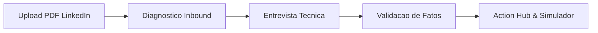

# LinkeGringo

[](https://opensource.org/licenses/MIT)
[](https://www.typescriptlang.org/)
[](https://react.dev/)
[](https://ai.google.dev/)
[](#privacidade--segurança)

> **Transforme seu perfil do LinkedIn brasileiro em um perfil de alta conversão para recrutadores dos Estados Unidos.**  
> 100% Client-Side • Bring Your Own Key (BYOK) • Auditoria no DevTools • Gratuito & Open Source.

---

## O Que é o LinkeGringo?

Muitos engenheiros de software brasileiros altamente qualificados são invisíveis para recrutadores dos Estados Unidos. O motivo não é falta de competência técnica — é o **viés cultural de comunicação**:
- Descrições passivas focadas em tarefas ("Participei do desenvolvimento de...").
- Falta de contexto de impacto, escala e decisões de arquitetura.
- Síndrome do impostor e receio com a fluência em inglês.

O **LinkeGringo** resolve isso através de uma jornada guiada por IA que analisa o seu PDF do LinkedIn, diagnostica gargalos reais, conduz uma entrevista adaptativa técnica e gera uma versão copy-ready em inglês americano idiomático, além de um checklist para o LinkedIn.

---

## Privacidade em Primeiro Lugar (BYOK 100% Client-Side)

Diferente de plataformas SaaS tradicionais que armazenam seu perfil em bancos de dados proprietários:
1. **Zero Backend**: Toda a aplicação roda exclusivamente no navegador do usuário (SPA estática).
2. **Bring Your Own Key (BYOK)**: Você utiliza a sua própria chave gratuita da API do **Google Gemini** (Google AI Studio).
3. **Privacidade Auditável**: Você pode abrir a aba *Network* do DevTools e verificar: as únicas requisições HTTP são enviadas diretamente do seu navegador para os servidores oficiais da Google (`generativelanguage.googleapis.com`).
4. **Armazenamento Local Seguro**: Sua API key fica salva apenas no `localStorage` do seu navegador e nunca é transmitida para terceiros.

---

## Jornada do Usuário



1. **Upload Direto do LinkedIn**: Arraste o PDF gerado pelo botão "Salvar como PDF" do seu perfil.
2. **Diagnóstico Inbound**: Métrica única de Inbound Readiness, funil de conversão (Busca ➔ Card ➔ Perfil ➔ InMail) e o maior desbloqueio imediato.
3. **Entrevista Técnica Adaptativa**: Perguntas cirúrgicas que extraem impacto, escala e decisões de arquitetura.
4. **Confirmação de Fatos**: Validação dos fatos técnicos extraídos para garantir precisão e zero alucinações.
5. **Action Hub (3 Abas)**:
   - **My Profile**: Card do recrutador Antes vs Depois e seções copy-ready (Headline, About, Experiências e Skills) com contadores de caracteres.
   - **Search**: Simulador de busca de recrutadores com termos-chave (MATCH, WEAK, MISSING).
   - **Launch**: Checklist das configurações externas essenciais no LinkedIn (Open to Work, 5 cargos-alvo, localização remota e perfil secundário em inglês).

---

## Quickstart (Como Rodar Localmente)

### Pré-requisitos
- Node.js `>= 22`
- pnpm `>= 11`

### 1. Clonar e Instalar
```bash
git clone https://github.com/Muriel-Gasparini/linkegringo.git
cd linkegringo
pnpm install
```

### 2. Rodar a Aplicação
```bash
pnpm dev
```
Abra `http://localhost:5173` no seu navegador.

---

## Como Obter Sua Chave Gratuita do Google Gemini

1. Acesse o [Google AI Studio](https://aistudio.google.com/).
2. Faça login com sua conta Google.
3. Clique em **"Get API key"** (Criar Chave de API).
4. Copie a chave gerada e insira no modal de configuração do LinkeGringo.

---

## Como Exportar o PDF do seu LinkedIn

1. Acesse seu perfil no [LinkedIn](https://www.linkedin.com/in/me/).
2. Clique no botão **Mais** (ou *More*) abaixo da sua foto e headline.
3. Clique em **"Salvar como PDF"** (ou *Save to PDF*).
4. Arraste o arquivo baixado para a área de upload do LinkeGringo.

---

## Estrutura do Repositório (Monorepo)

```
linkegringo/
├── packages/
│   ├── core/       # @linkegringo/core — Dominio, Schemas Zod, tipos e formulas determinísticas
│   └── ai/         # @linkegringo/ai   — Provedor Gemini (@google/genai), Mock offline e prompts
├── apps/
│   └── web/        # @linkegringo/web  — SPA React 19 + Vite + Tailwind CSS v4
├── .github/        # Workflows CI/CD (Deploy GitHub Pages e CI)
└── docs...
```

---

## Scripts Disponíveis

```bash
# Iniciar o servidor de desenvolvimento web
pnpm dev

# Compilar todos os pacotes e app web
pnpm build

# Checar tipos em todo o monorepo
pnpm typecheck

# Executar testes automatizados
pnpm test
```

---

## Como Contribuir

Contribuições são bem-vindas. Consulte o arquivo [CONTRIBUTING.md](CONTRIBUTING.md) para detalhes sobre convenções de código, testes e fluxo de trabalho.

---

## Segurança e Privacidade

Leia a política de segurança em [SECURITY.md](SECURITY.md).

---

## Licença

Distribuído sob a licença **MIT**. Veja [LICENSE](LICENSE) para mais informações.  
Desenvolvido por **Muriel Gasparini**.
